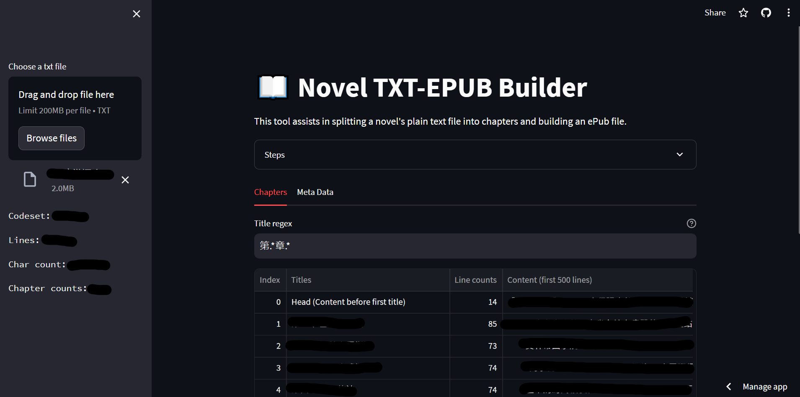

# 📖 Novel TXT-EPUB Builder

This tool assists in splitting a novel's plain text file
into chapters and building an ePub file.

## Steps

1. Choose the TXT file containing the novel.
2. Automatically split the TXT file into chapters using a regular expression
based on chapter titles.
3. Fill in the book's metadata.
4. Click the `Prepare EPUB` button and wait for the Download button to appear.
5. Download the generated ePub file.
